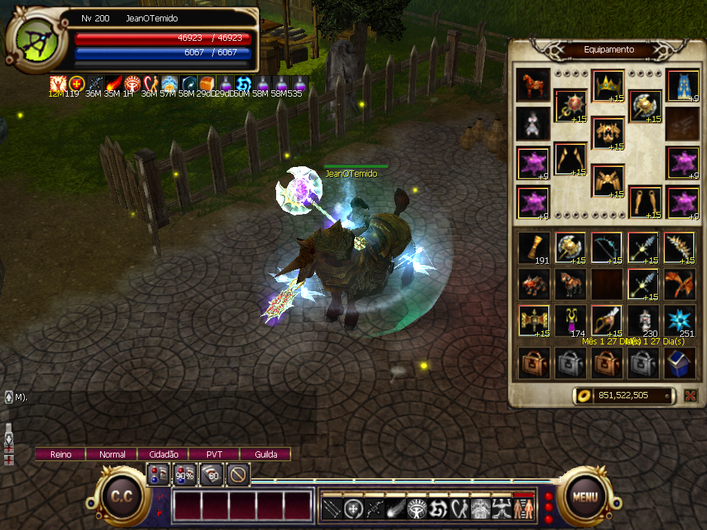

# w2pp-OpenWYD
servidor aberto de wyd

Reescrita em **Go** (big-bang) do servidor do WYD (With Your Destiny), mirando o **client `WYD.exe`
7662 sem modificação** (protocolo 7640). Os fontes legados em C++ ficam em `Source/`, os binários
legados + conteúdo do jogo em `Release/`, e os serviços Go novos em `tmserver/`, `dbserver/`,
`binserver/`, `webserver/`. A reescrita é guiada pela engenharia reversa documentada em
`docs/migration/`. Agradecimentos ao pessoal que me forneceu os fontes.

> Para detalhes de arquitetura, comandos e convenções, veja `CLAUDE.md`.

## Serviços

Só a borda client↔tmServer fala o protocolo legado; os links internos são gRPC (+mTLS):

- **tmServer** (`:8281` jogo + `:80` status) — servidor do jogo; dono de todo o estado do mundo em
  memória, num único goroutine sem locks (espelha o reactor single-thread original).
- **dbServer** (`:7514`) — persistência (PostgreSQL/pgx v5) via gRPC `api/db/v1`.
- **binServer** (`:3000`) — gate de billing via gRPC `api/bin/v1`.
- **webServer** (`:7600`) — web-api (gRPC `api/web/v1`) que a plataforma web (Next.js BFF) chama
  server-side; criar conta, login web e, no plano, cash/ranking/loja-web.

Pacotes compartilhados (store, migrations, domain, secret/argon2id) ficam na raiz `internal/`.

## Como rodar

```bash
make run            # só o tmserver, persistência no-op — bring-up rápido do protocolo
make run-local      # stack completa via docker compose + semeia a conta test/test123
make test           # go test -race -cover ./...
```

`make run-local` imprime o IP:porta para apontar um client Windows real. A conta começa sem
personagens — crie-os no client.

# Link do client no servidor de teste
(http://wydcdk.com.br/)
(https://drive.google.com/file/d/1RLM-AI1VmqeRw_4-7cM5ZCLmgie0zaL_/view?usp=sharing)

# Link do client 759
(https://drive.google.com/file/d/1WZRbVFrNRpd7fsjFcXqr-Rb3ijpts_0V/view?usp=sharing)

cliente versão 7.59
<br>
